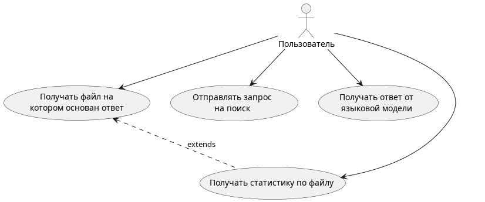
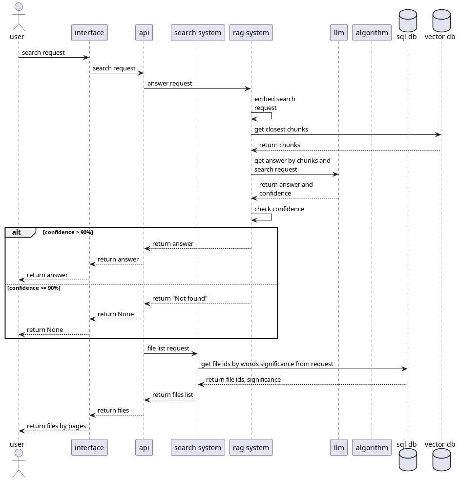

# Лабораторная №7 по дисциплине ЕЯЗИИС

use-case

sequence

db schema

## Start guide

### Backend

go to backend directory

`cd backend/`

activate virtual environment

`source .venv/bin/activate` (ubuntu)

install dependencies

`pip install -r requirements.txt`

run api

`fastapi dev main.py`
