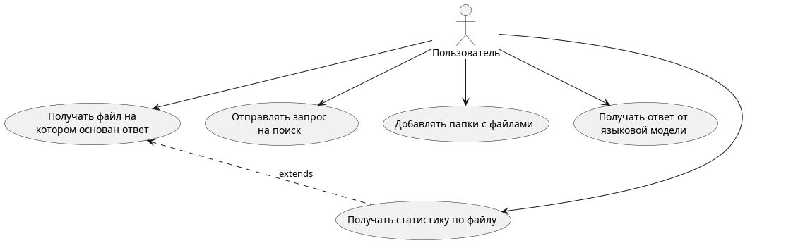
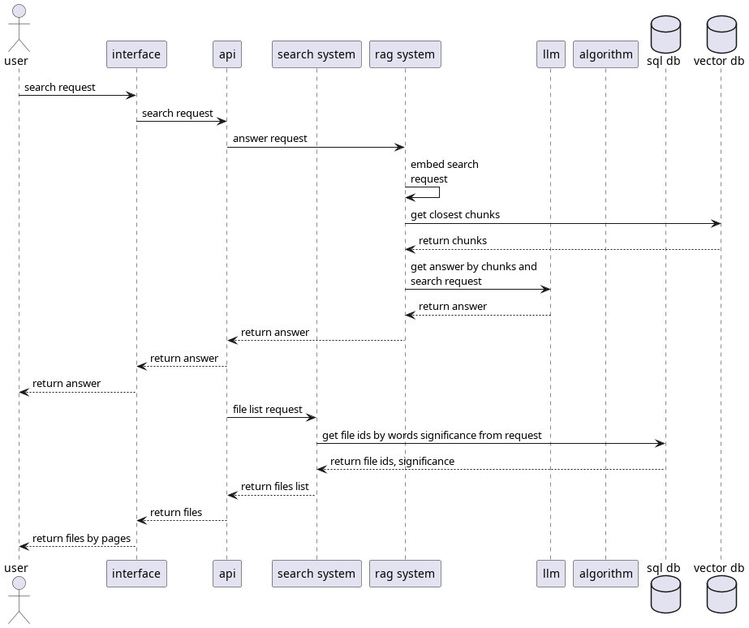
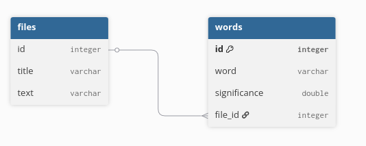
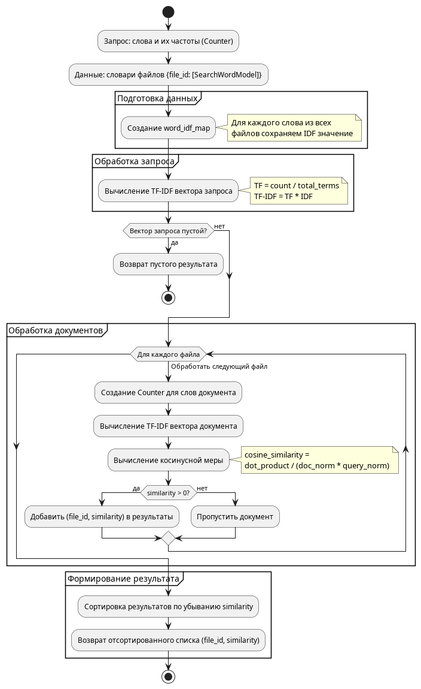
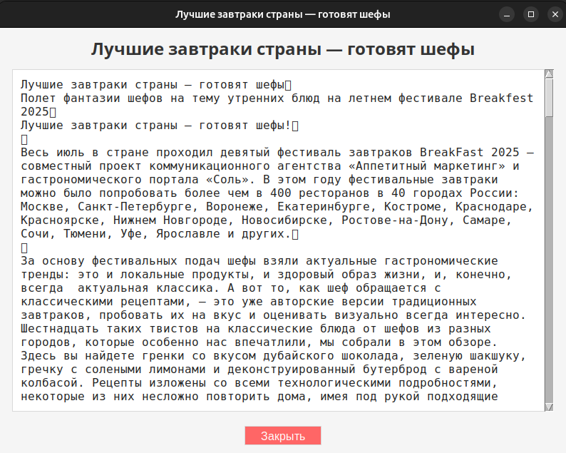
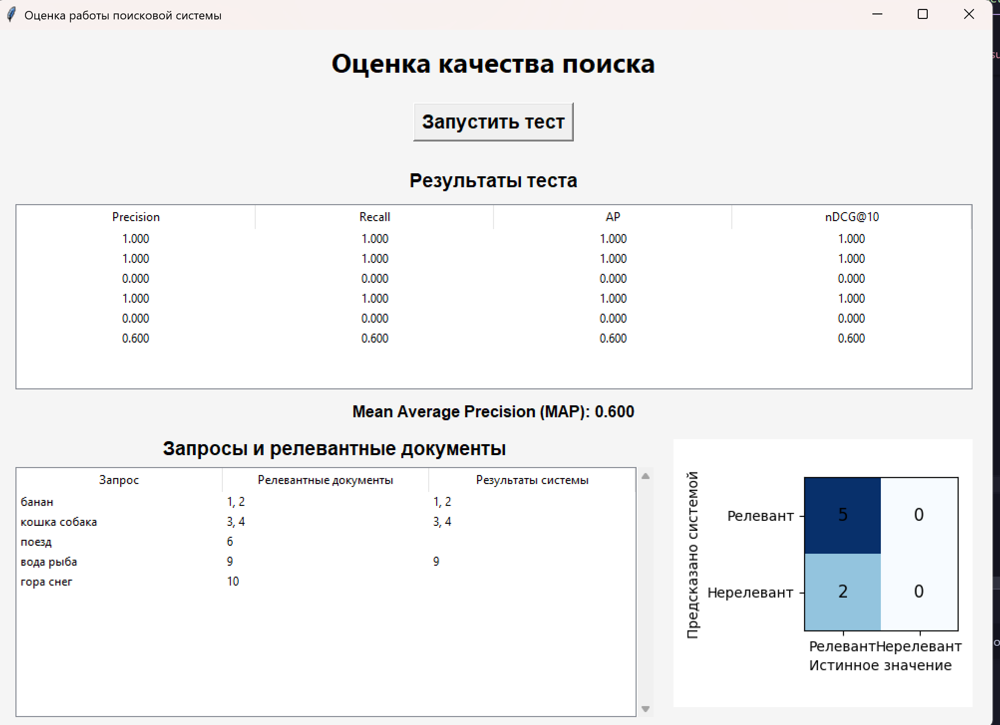

# Лабораторная №7 по дисциплине ЕЯЗИИС "Разработка информационно-поисковой системы и методы оценки качества ее работы"

## Условия

*Цель работы:* освоить на практике основные принципы реализации
информационно-поисковых систем и методы оценки качества их работы.

*Предметная область:* Кулинария

## Требования к разрабатываемой системе

- на входе – множество естественно-языковых текстов по которым
осуществляется поиск;
- выделение ключевых слов документов осуществляется системой
автоматически в соответствие с формулой 1.6;
- система должна позволять пользователю формулировать ЕЯ-запрос;
- на выходе – список документов, релевантных запросу пользователя, в
соответствие с моделью поиска, согласно варианту;
- результаты поиска должны содержать: активную ссылку на документ,
список слов запроса присутствующих в документе.
- на основании информации о существующих метриках, наиболее часто
использующихся для оценки качества работы систем информационного
поиска, требуется дать оценку работы СИП.
Вычисление оценок, получаемых на основании метрик, реализовать
программно, путем вызова соответствующего подменю, и отображать в виде
таблиц и графиков
- интерфейс системы должен быть предельно простым и доступным для
пользователей любого уровня, содержать понятный набор инструментов и
средств, а также help-средства.

## Вариант 3

| Реализация элементов ИИ | Сфера применения | Стратегия поиска | Язык |
|-------------------------|------------------|------------------|------|
| Интерфейс с пользователем | Локальная вычислительная сеть | Векторная | Русский |

## Проектирование

### Use-case диаграмма

### Sequence диаграмма

### Схема базы данных

### Алгоритм векторного поиска

### Синхронизация файловой системы

Отдельно для клиента запущен файловый синхронизатор, который:

- Получает скриншот базы файлов, содержащий путь к файлу клиента и его хэш
- Проверяет значения в скриншоте с действительными на данный момент
- Исправляет базу данных на текущее состояние(add, update, delete)

## Интерфейс

### Заглавная страница

### Результат поиска

### Содержимое документов

### Оценка работы СИП
1. В качестве тестовых документов были выбраны 10 простых текстовых файлов, содержащие тройку-четверку слов.
2. Из известного выбора были сформулированы 5 запросов с известным результатом, следовательно, выбраны действительно релевантные документы.
3. Каждый запрос отправляется в систему для определения ей релевантных документов.
4. На основании полученных данных строятся результаты работы системы.
5. В качестве метрик были выбраны точность(P), полнота(R), усредненная точность(AP), MAP и строится матрица ошибок.

  

## Возможные улучшения

- Добавить многозадачность в интерфейсе, для того чтобы не происходило "зависания" при запросе.
- Добавить возможность дополнения базы документов пользователем.
- Найти лучшую комбинацию модели эмбединга, способа разбиения на чанки и языковой модели для ответа.
- Расширение базы документов.

## Используемые библиотеки

- fastapi - фреймворк для бэкэнда
- tkinter - интерфейс
- sqlalchemy - orm для работы с базой данных
- aiosqlite - двигатель для асинхронной работы с sqlite
- requests - для запросов с фронтэнда на бэкэнд
- natasha - для нахождения лемм
- langchain - для работы с языковыми моделями
  

## Вывод

В данной работе были изучены ключевые принципы реализации
информационно-поисковых систем и методы оценки качества их работы. В рамках лабораторной работы была реализована поисковая система, способная принимать запросы от пользователя на русском языке и отдавать короткий ответ от RAG агента, а также список файлов с наиболее релевантной информацией. Результатом реализации служит программа, способная помогать пользователю в поиске кулинарной литературы.
